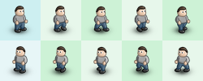

# Game Component: Texture Atlas

A component for chopping up images into multiple canvases.

Also provides a content processor wrapper for use with the [Content Manager](https://www.npmjs.com/package/@basementuniverse/content-manager).

## Installation

```bash
npm install @basementuniverse/texture-atlas
```

## How to use



_(Example spritesheet for a character)_

The function can be called directly:

```ts
import { textureAtlas } from '@basementuniverse/texture-atlas';

const characterSpriteSheet = new Image();
characterSpriteSheet.src = './character-spritesheet.png';
characterSpriteSheet.onload = () => {
  const textureAtlasConfiguration = {
    relative: true,
    width: 5,
    height: 2,
    regions: {
      idle_left: { x: 0, y: 0 },
      idle_right: { x: 0, y: 1 },
      walk_left: { x: 1, y: 0, width: 4 },
      walk_right: { x: 1, y: 1, width: 4 },
    },
  };

  const atlas = textureAtlas(
    myImage,
    textureAtlasConfiguration
  );
  // {
  //   idle_left: HTMLCanvasElement,
  //   idle_right: HTMLCanvasElement,
  //   walk_left: HTMLCanvasElement,
  //   walk_right: HTMLCanvasElement,
  // }
};
```

Or as a content processor:

```ts
import { textureAtlasContentProcessor } from '@basementuniverse/texture-atlas';
import ContentManager from '@basementuniverse/content-manager';

ContentManager.initialise({
  processors: {
    textureAtlas: textureAtlasContentProcessor,
  },
});

ContentManager.load([
  {
    name: 'character-spritesheet',
    type: 'image',
    args: ['./character-spritesheet.png'],
  },
  {
    name: 'character-atlas',
    type: 'json',
    args: [
      {
        relative: true,
        width: 5,
        height: 2,
        regions: {
          idle_left: { x: 0, y: 0 },
          idle_right: { x: 0, y: 1 },
          walk_left: { x: 1, y: 0, width: 4 },
          walk_right: { x: 1, y: 1, width: 4 },
        },
      }
    ],
    processors: [
      {
        name: 'textureAtlas',
        args: ['character-spritesheet'],
      },
    ],
  },
]);
```

This should result in the following content items being available:

```ts
const characterSpriteSheet = ContentManager.get('character-spritesheet');
// HTMLImageElement

const characterAtlasData = ContentManager.get('character-atlas');
// object

const idleLeft = ContentManager.get('idle_left');
// HTMLCanvasElement

const idleRight = ContentManager.get('idle_right');
// HTMLCanvasElement

const walkLeft = ContentManager.get('walk_left');
// HTMLCanvasElement

const walkRight = ContentManager.get('walk_right');
// HTMLCanvasElement
```

## Texture Atlas options

```ts
export type TextureAtlasOptions = {
  /**
   * In relative mode, the width and height of the texture atlas is
   * measured in cells
   *
   * (i.e. the image will be divided into `width` sections horizontally
   * and `height` sections vertically, with each section representing a
   * cell in the atlas)
   *
   * In non-relative (absolute) mode, the width and height properties
   * represent the size of a cell in the atlas, measured in pixels
   */
  relative: boolean;

  /**
   * The width of the texture atlas (measured in cells) or the width of
   * a cell in the atlas (measured in pixels), depending on relative or
   * absolute mode
   */
  width: number;

  /**
   * The height of the texture atlas (measured in cells) or the height
   * of a cell in the atlas (measured in pixels), depending on relative
   * or absolute mode
   */
  height: number;

  /**
   * A dictionary of regions, where each key is a name for the resulting
   * region's image
   *
   * If using the Content Manager Processor function, the key will be used
   * as the name of each image in the Content Manager
   */
  regions: Record<string, TextureAtlasRegion>;
};

export type TextureAtlasRegion = {
  /**
   * X-offset for this region, measured in cells or pixels, depending on
   * relative or absolute mode
   */
  x: number;

  /**
   * Y-offset for this region, measured in cells or pixels, depending on
   * relative or absolute mode
   */
  y: number;

  /**
   * Width of this region, measured in cells or pixels, depending on
   * relative or absolute mode
   *
   * If not defined:
   * - in absolute mode use the remaining width of the image
   * - in relative mode this defaults to 1
   */
  width?: number;

  /**
   * Height of this region, measured in cells or pixels, depending on
   * relative or absolute mode
   *
   * If not defined:
   * - in absolute mode use the remaining height of the image
   * - in relative mode this defaults to 1
   */
  height?: number;
};
```
